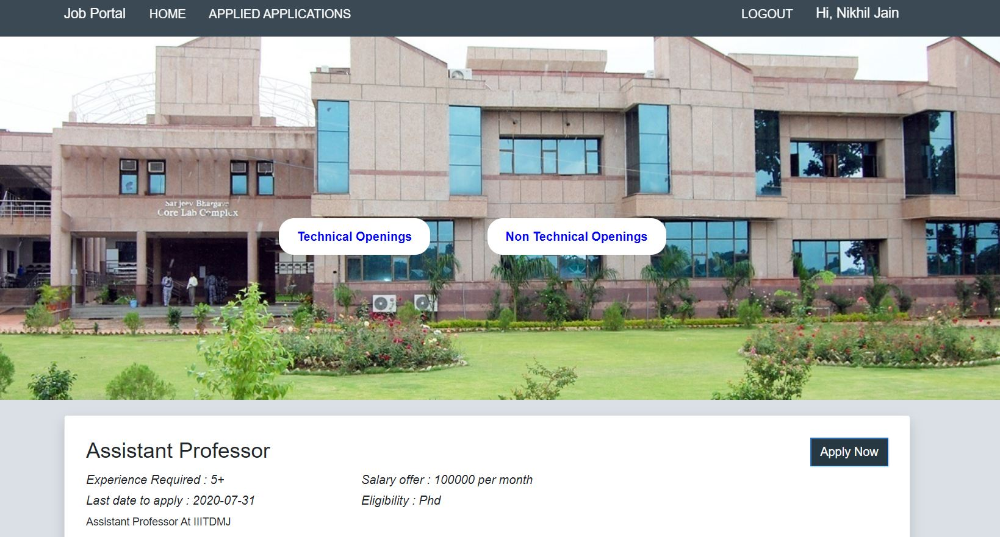
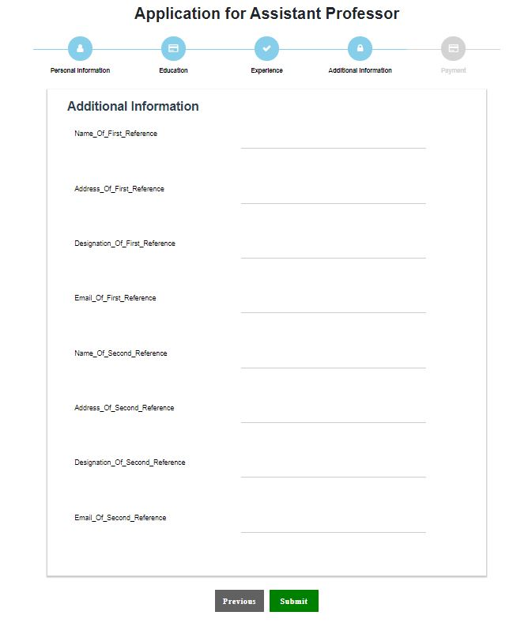
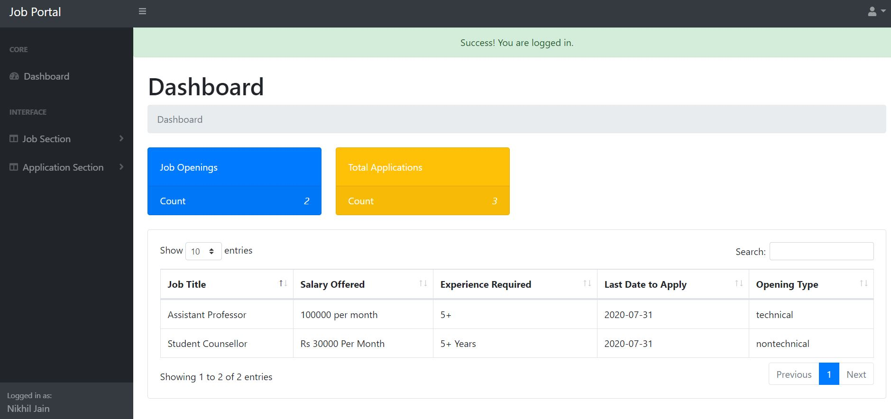
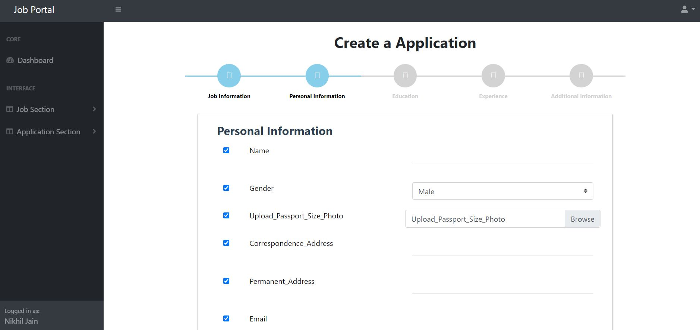
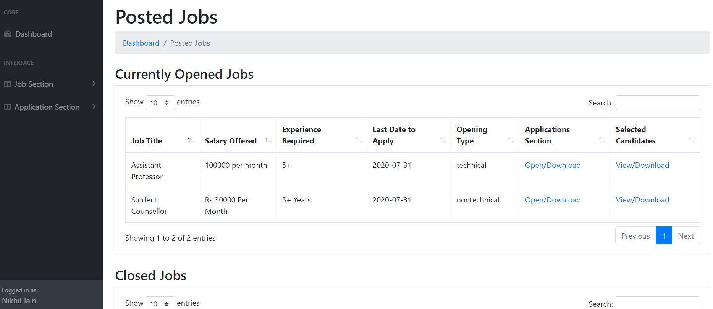
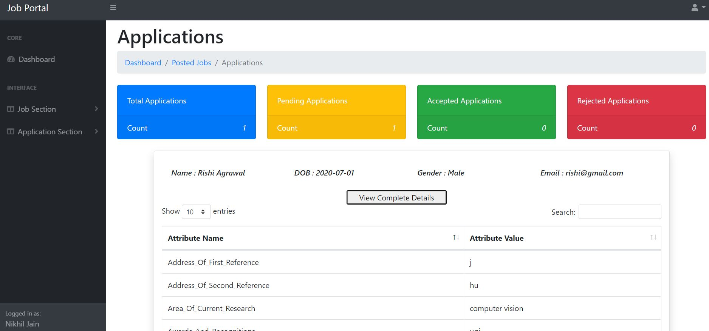

# Job_Application_Portal

An online portal allowing applicants to find ideal jobs and employers to locate ideal candidates.

## Demo Link

[To visit Job Portal](http://jobportal2021.herokuapp.com/)

[To access admin section](http://jobportal2021.herokuapp.com/admin)

## Features 
* Admin Side
  - Admin signIn/signUp
  - Different Admin types each having different access levels (ADMIN having the complete access and STAFF having some restricted access 
  - Admin can decide what all fields need to be included in the job application form while creating the job post i.e creating dynamic application form according to the type and requirements of the Job. 
  - Accepting and Rejecting the Candidate's application
  - Downloading data in CSV format of the selected candidates 
  - Declaring result and notifying each candidate via email

* Candidate Side
  - Candidate signIn/signUp
  - Separate Sections for Technical and Non Technical Job Openings 
  - Applied Application Section to keep track of the applied applications
  - Email Updates


## Setup
         
```bash
git clone https://github.com/nikhil6418/Application_Tracking_System.git
npm install
npm start
```

## Candidate DashBoard


## Job Application Stepper Form


## Admin DashBoard


## Job Post Creation 


## View And Download candidate's data


## Candidate's Application for a particular job

